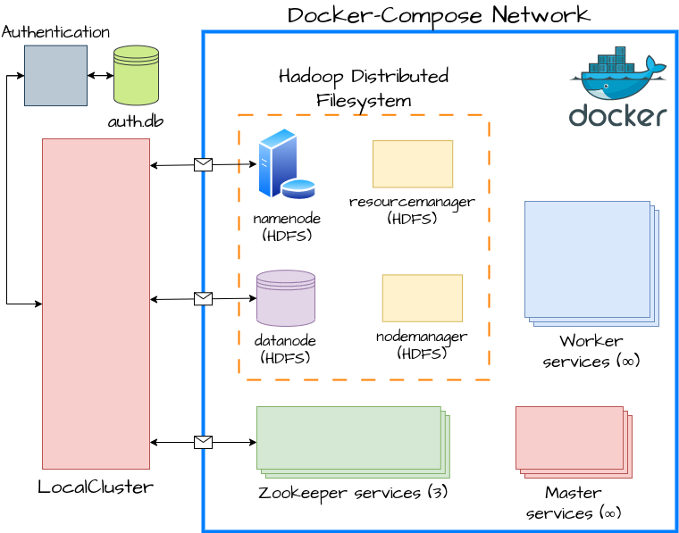

## MapReduce Implementation

This is a (from-scratch) implementation of the MapReduce framework as proposed in [MapReduce: Simplified Data Processing on Large Clusters](https://static.googleusercontent.com/media/research.google.com/el//archive/mapreduce-osdi04.pdf).

## Pre-requisites

Install `docker` and `docker-compose` (if you haven't already).

Create a `conda` environment

```bash
conda create -n mapreduce python=3.11.3
conda activate mapreduce
```

Then, install the requirements.

```bash
pip install -r requirements.txt
```

Go inside the root of the project `~/MapReduce-Implementation` and install the project as a package.

```bash
pip install -e .
```

For `LocalCluster` to work modify `/etc/hosts`, add the following:
```
127.0.0.1       datanode
```
We do this because the hadoop *namenode* (that we talk to for *HDFS*) returns the hostname of the
datanode (i.e., `datanode`) but this returned hostname is inside the `docker-compose` network. 
This happens internally in the `kazoo` library hence this is the most straight-forward solution.

## Usage

Go to the `examples` folder and familiarize yourself with the API by running the notebooks.

## Distributed System Architecture



See `examples/1.Introduction.ipynb` for a detailed explanation of the architecture.

## Fault Tolerance

If <ins>at all times at least one</ins> *master* service is alive, we guarantee fault tolerance for the following scenarios:
1. *Worker* failures at any time.
2. *Master* failures at any time.

See `examples/2.Fault-Tolerance.ipynb` for an explanation of the fault tolerance mechanisms.

## MapReduce

### Map Function

`map([x1, x2, ...]) -> [(k1, v2), (k2, v2), ...]` (elements are arbitrary)

Example:
```python
def map_func(data):
    result = []
    for string in data:
        for char in string:
            result.append((char, 1))
    return result
```

```python
Input: ["mike", "george", "meg"]
Output: [('m', 1), ('i', 1), ('k', 1), ('e', 1), ('g', 1), ('e', 1), ('o', 1),
         ('r', 1), ('g', 1), ('e', 1), ('m', 1), ('e', 1), ('g', 1)]
```

### Shuffle
Intermediate results of the *map* function are shuffled (sorted and grouped by **key**). This operation is straightforward.
```python
Input: [('m', 1), ('i', 1), ('k', 1), ('e', 1), ('g', 1), ('e', 1),
        ('o', 1), ('r', 1), ('g', 1), ('e', 1), ('m', 1)]
Output: [('e', [1, 1, 1, 1]), ('g', [1, 1]), ('i', [1]), ('k', [1]),
         ('m', [1, 1]), ('o', [1]), ('r', [1])]
```


### Reduce Function
`reduce([v1, v2, ...]) -> y` (elements are arbitrary)

```python
def reduce_func(values):
    return sum(values)
```
```python
Input: [('e', [1, 1, 1, 1]), ('g', [1, 1]), ('i', [1]), ('k', [1]),
         ('m', [1, 1]), ('o', [1]), ('r', [1])]
Output: [('e', 4), ('g', 2), ('i', 1), ('k', 1), ('m', 2), ('o', 1), ('r', 1)]
```

## Repository Structure
```markdown
MapReduce-Implementation/
├── mapreduce/
│   ├── __init__.py
│   ├── authentication/
│   │   ├── __init__.py
│   │   ├── authentication.py
│   │   ├── auth.py
│   │   └── auth.db
│   ├── cluster/
│   │   ├── __init__.py
│   │   └── local_cluster.py
│   ├── monitoring/
│   │   ├── __init__.py
│   │   └── local_monitoring.py
│   ├── workers/
│   │   ├── __init__.py
│   │   ├── master.py
│   │   └── worker.py
│   ├── zookeeper/
│   │   ├── __init__.py
│   │   └── zookeeper_client.py
│   ├── hadoop/
│   │   ├── __init__.py
│   │   └── hdfs_client.py
├── tests/
│   ├── __init__.py
│   ├── integration_tests/
│   │   ├── __init__.py
│   │   ├── test_hdfs_client.py
│   │   ├── test_zookeeper_client.py
│   │   └── test_local_cluster_local_monitoring.py
│   ├── unit_tests/
│   │   ├── __init__.py
│   │   ├── test_authentication.py
│   │   └── test_worker.py
├── examples/
│   ├── 1. Introduction.ipynb
│   ├── 2. Fault-Tolerance.ipynb
│   └── Miscellaneous.ipynb
├── hadoop.env
├── requirements.txt
├── Dockerfile.worker
├── Dockerfile.master
├── docker-compose.yaml
└── README.md
```