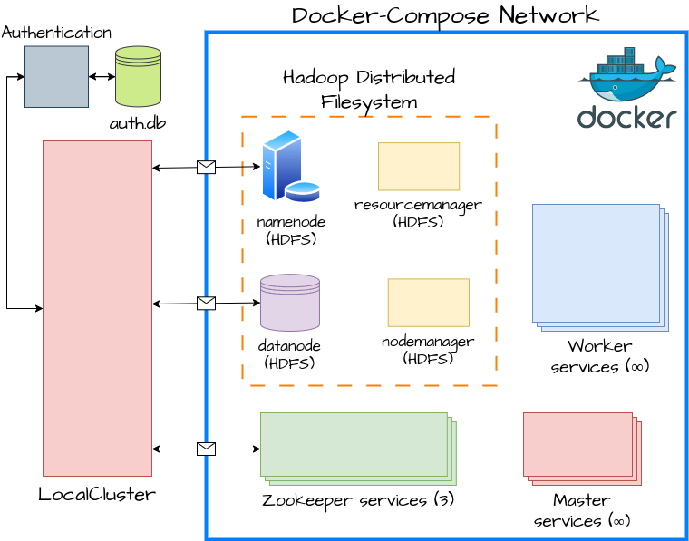

## Pre-requisites

For `LocalCluster` to work modify `/etc/hosts`, add the following:
```
127.0.0.1       datanode
```
We do this because the hadoop *namenode* (that we talk to add files to hdfs) returns
the hostname of the datanode (i.e., `datanode`) but this returned hostname is inside the docker-compose
network.

```bash
pip install -r requirements.txt
```

## Usage

Go to the `examples` folder and familiarize yourself with the API by running the notebooks.

## MapReduce

### Map Function

`map([x1, x2, ...]) -> [(k1, v2), (k2, v2), ...]` 

Example:
```python
def map_func(data):
    result = []
    for string in data:
        for char in string:
            result.append((char, 1))
    return result
```

```python
Input: ["mike", "george", "meg"]
Output: [('m', 1), ('i', 1), ('k', 1), ('e', 1), ('g', 1), ('e', 1), ('o', 1),
         ('r', 1), ('g', 1), ('e', 1), ('m', 1), ('e', 1), ('g', 1)]
```

### Shuffle
Intermediate results of the *map* function are shuffled (sorted and grouped by **key**). This operation is straightforward.
```python
Input: [('m', 1), ('i', 1), ('k', 1), ('e', 1), ('g', 1), ('e', 1),
        ('o', 1), ('r', 1), ('g', 1), ('e', 1), ('m', 1)]
Output: [('e', [1, 1, 1, 1]), ('g', [1, 1]), ('i', [1]), ('k', [1]),
         ('m', [1, 1]), ('o', [1]), ('r', [1])]
```


### Reduce Function
`reduce([v1, v2, ...]) -> y`

```python
def reduce_func(values):
    return sum(values)
```
```python
Input: [('e', [1, 1, 1, 1]), ('g', [1, 1]), ('i', [1]), ('k', [1]),
         ('m', [1, 1]), ('o', [1]), ('r', [1])]
Output: [('e', 4), ('g', 2), ('i', 1), ('k', 1), ('m', 2), ('o', 1), ('r', 1)]
```

## Repository Structure
```markdown
MapReduce-Implementation/
├── mapreduce/
│   ├── __init__.py
│   ├── cluster/
│   │   ├── __init__.py
│   │   └── local_cluster.py
│   ├── monitoring/
│   │   ├── __init__.py
│   │   └── local_monitoring.py
│   ├── workers/
│   │   ├── __init__.py
│   │   ├── master.py
│   │   └── worker.py
│   ├── zookeeper/
│   │   ├── __init__.py
│   │   └── zookeeper_client.py
│   ├── hadoop/
│   │   ├── __init__.py
│   │   └── hdfs_client.py
├── tests/
│   ├── __init__.py
│   ├── integration_tests/
│   │   ├── __init__.py
│   │   ├── test_hdfs_client.py
│   │   ├── test_zookeeper_client.py
│   │   └── test_local_cluster_local_monitoring.py
│   ├── unit_tests/
│   │   ├── __init__.py
│   │   └── test_worker.py
├── examples/
│   ├── __init__.py
│   ├── testing.ipynb
├── README.md
├── requirements.txt
├── Dockerfile.worker
├── Dockerfile.master
├── TODO.txt
├── docker-compose.yaml
└── hadoop.env
```

### Distributed System Architecture

We set up a docker-compose network with *workers*, *masters*, *zookeeper* and *hdfs*. The requirement of the system is that
we can externally talk with hdfs and zookeeper. The rest of the components are internal to the docker-compose network.

### Fault Tolerance

We guarantee fault tolerance for the following scenarios, if at least one *master* service is alive:
- *Worker* failures at any time.
- *Master* failures at any time.

### Tests

```bash
python -m unittest tests.unit_tests.test_worker
python -m unittest tests.unit_tests.test_authentication
python -m unittest tests.integration_tests.test_hdfs_client
python -m unittest tests.integration_tests.test_zookeeper_client
python -m unittest tests.integration_tests.test_local_cluster_local_monitoring
```


